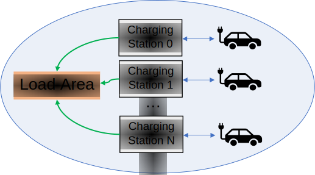
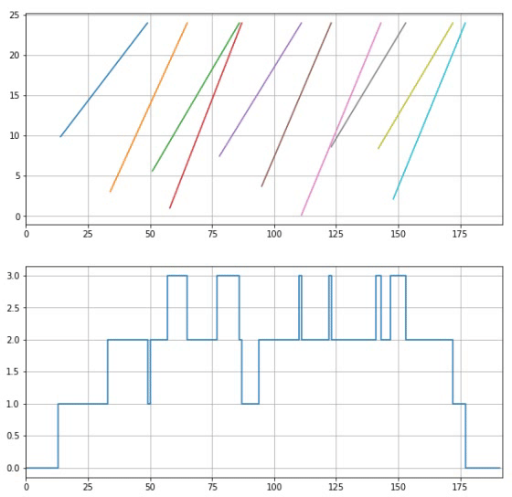
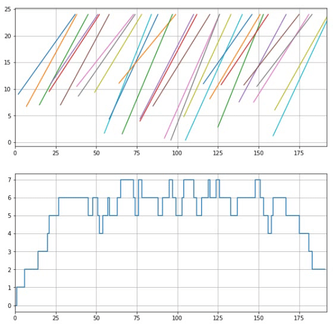

# Plug-in Electric Vehicles (PEV) Battery Charging Environment

## Overview

This readme describes the operation of the `PEVChargeBattery` environment, designed as a multi-agent scenario with continuous observation and action space, where the agents are charging stations that must meet the energy requirements of a previously-scheduled group of PEVs (Plug-in Electric Vehicles), constrained to a local power supply restriction, and a global restriction from the containing Load Area.

This code and plant are a Deep Learning implementation of the MPC approach described in this paper: https://www.researchgate.net/publication/337643000_Decentralised_Model_Predictive_Control_of_Electric_Vehicles_Charging

In the following picture, a speeded-up simulation of the load of 20 EV (Electric vehicles) with 5 Charging Stations (CS) is animated, where the power supplied by the stations in the upper bar chart adds energy to the battery level in the bottom on, according to the schedule in the middle.  


## Installation

Requirements:

* `numpy` >= 1.16.4
* `gym` >= 0.17.3 
* `imageio` >= 2.9.0

```
git clone https://github.com/ArciAndres/pev_battery_charge
cd pev_battery_charge
pip install -e .
```

## Environment

The environment is designed as a continuous Partially Observable Markov Decision Process (POMDP), where the agents (CS) are connected to a general load area with a fixed maximum supply power allowed. The PEVs are entities that get plugged in to the CSs with a requirement of energy load to be provided within a certain amount of time. 





### Observation space

Each agent counts only with the information provided by the car, and the general power, aiming to design a solution completely distributed. A parameter sharing solution can be explored at the beginning, to then go further with more complex setups. 

For each agent, it is `Box(0, np.inf, (8,))` space, formed by the following elements:

1. `cs.p_min`: Minimum CS power allowed
1. `cs.p_max`: Maximum CS power allowed
1. `area.P_max`: Maximum area load power allowed
1. `area.P_min`: Minimum area load power allowed
1. `cs.plugged`: Station plugged or not
1. `soc_remain`: $SOC$ level remaining (kWh)
1. `area.P`: Current aggregated power of the area (kW)
1. `action_last`: Last applied action

### Action space

For each agent, it is a single continuous value space `Box(0, p_max, (1,))`, where `p_max` corresponds to the maximum available power for this agent. 

### Rewards

It is designed as a sum of multiple conditions: The remaining SOC, the surpassing on local limits and global limits. The weight of each one can be tuned on the `config_pev.py` file. 

```python
def _computeReward(self):
    """ Reward has multiple weights and penalizations. """
    
    rewards = []
    for cs in self.charge_stations:
        rew = [0]*len(self.rew_weights)
        if cs.plugged:
            pev = self.pevs[cs.pev_id]
            
            # Penalization on remaining SOC
            soc_remain = pev.soc - pev.soc_ref
            rew[0] = soc_remain/self.soc_ref # Normalized on the reference, not max
            
            # Penalization surpassing local limit
            if cs.p > cs.p_max or cs.p < cs.p_min:
                rew[1] = (-1)
            
            # Penalization surpassing global limit
            if self.area.P > self.area.P_max or self.area.P < self.area.P_min:
                rew[2] = (-1)
        
        reward = np.array(rew)*self.rew_weights
        rew = sum(rewards)
        self.info_rewards = { ("rew%d"%i) : rewards[i] for i in range(len(rewards)) }
    
        rewards.append(sum(reward))  
    
    rewards = [[r] for r in rewards] ## Added to match the array size in training
    return rewards
```
## Schedule generation

During simulation, with the `reset` method, a new case study is generated, depending on the parameters provided by the `config_pev.py` file. Below it is depicted a greedy loading example of 10 and 30 vehicles, in a timespan of 16 hours (960 minutes) with a sampling time ($\Delta t$) of 5 minutes, which gives 192 samples in total. In the upper charts it is shown a linear charge of the vehicles' batteries (without considering any global limits), and below the number of simultaneous vehicles connected to the charging stations at $t$ timestep. 

|                     10 Plug-in vehicles                      |                     30 Plug-in vehicles                      |
| :----------------------------------------------------------: | :----------------------------------------------------------: |
|  |  |


